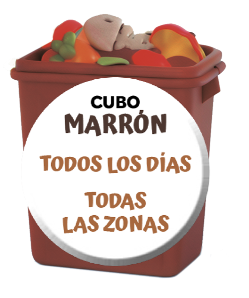
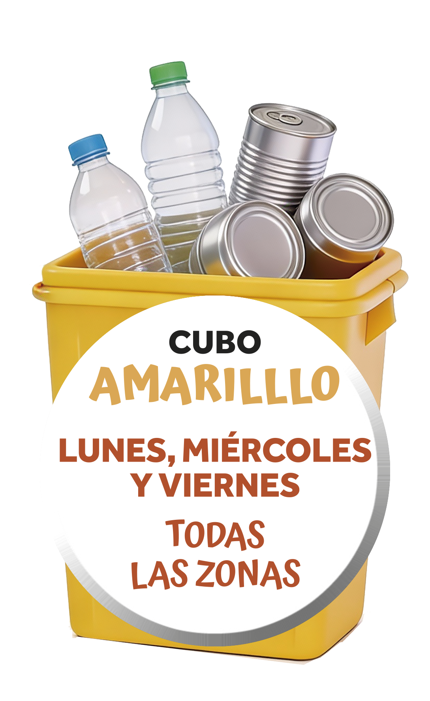
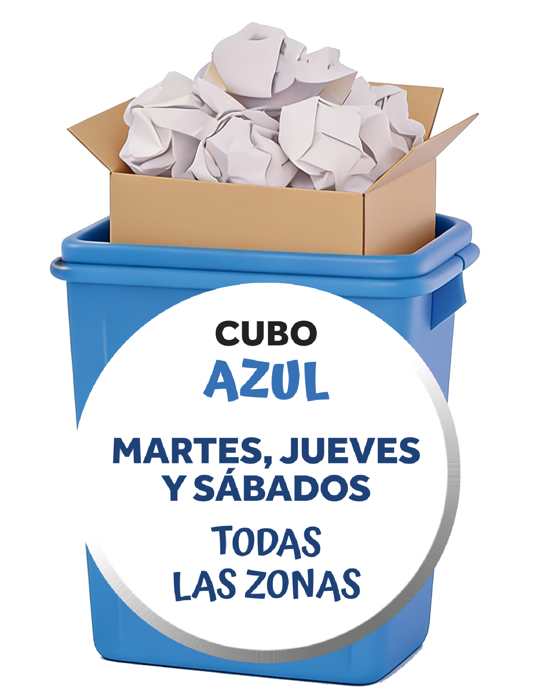
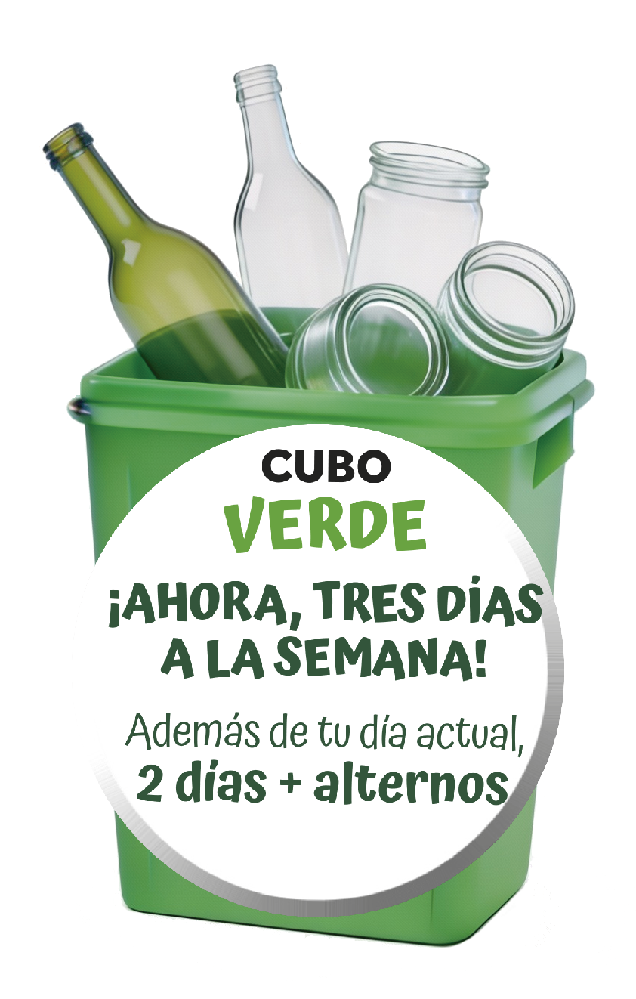
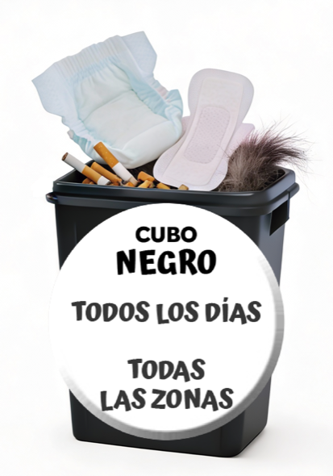

# Руководство по переработке и сбору отходов в Овьедо

> Источник: [Мэрия Овьедо (Ayuntamiento de Oviedo)](https://www.oviedo.es/serviciosbasicos/recogidabasuras)

**Время выноса:** с 20:00 до 22:30.

**Штраф за несортировку:** до **750 €** — административное нарушение (infracción leve). Основание:
- Государственный закон Испании [Ley 7/2022](https://www.boe.es/eli/es/l/2022/04/08/7/con) об отходах и загрязнённых почвах
- Муниципальный регламент Овьедо о чистоте улиц и сборе бытовых отходов (Ordenanza municipal de Limpieza de vías públicas y recogida de residuos domésticos)
- Муниципальный регламент №108 — тариф на вывоз мусора (Ordenanza 108, Tasa por recogida de basuras, 2026)

---

## 1. Коричневый контейнер (Cubo Marrón) — Органические отходы (Residuos Orgánicos)

**Частота:** каждый день, включая воскресенья и праздники.

### Что МОЖНО выбрасывать

| Категория | Примеры |
|-----------|----------|
| Остатки еды (restos de alimentos) | Бобовые (legumbres), фрукты (frutas), овощи (verduras/hortalizas), мясо (carne), рыба (pescado), морепродукты (marisco) — сырые или приготовленные |
| Скорлупа и кожура (cáscaras y pieles) | Яичная скорлупа (cáscaras de huevo), панцири морепродуктов (marisco), орехи (frutos secos); кожура и косточки фруктов (pieles y huesos de fruta) |
| Просроченные продукты (productos caducados) | Испорченные или просроченные продукты, без упаковки |
| Молочка, хлеб, крупы (lácteos, pan, cereales) | Молочные продукты (productos lácteos), хлеб и выпечка (pan y bollería), зерновые и крупы (granos y cereales) |
| Прочая органика (otros orgánicos) | Кофейная гуща (posos de café), чайные пакетики (infusiones), грязные бумажные полотенца и салфетки (papel de cocina y servilletas sucias), мелкие садовые отходы (pequeños restos de jardinería), пробки (tapones de corcho), стружка и опилки (virutas de madera y serrín) |

### Что НЕЛЬЗЯ выбрасывать

- Керамика (objetos de cerámica)
- Подгузники и влажные салфетки (pañales y toallitas húmedas)
- Средства интимной гигиены (productos de higiene íntima)
- Окурки и жвачки (colillas y chicles)
- Наполнитель для животных / экскременты (arena para mascotas / excrementos)
- Волосы / шерсть (pelo humano o animal)
- Пыль или зола (polvo o cenizas)
- Кухонное масло (aceite de cocina) — см. отдельный раздел
- Лекарства (medicamentos)
- Крупные ветки после обрезки (podas grandes)
- Отходы из других контейнеров (residuos de otros contenedores)

---

## 2. Жёлтый контейнер (Cubo Amarillo) — Упаковка: пластик, металл, тетрапак (Envases: Plástico, Metal, Brik)

**Частота:** понедельник, среда, пятница (lunes, miércoles, viernes).

### Что МОЖНО выбрасывать

| Категория | Примеры |
|-----------|----------|
| Пластиковая упаковка (envases de plástico) | Пакеты (bolsas), бутылки (botellas), канистры для воды (garrafas de agua), стаканчики из-под йогурта (envases de yogur), лотки для яиц (hueveras), крышки (tapas), сетки для фруктов (mallas de frutas), бутылки моющих средств (botes de limpieza), лотки/подносы (bandejas), упаковки косметики (envases de cosméticos), пищевая плёнка (film transparente) |
| Металлическая упаковка (envases metálicos) | Банки из-под напитков (latas de bebidas), консервные банки (botes de conservas), алюм. тарелки и лотки (platos y bandejas de aluminio), фольга (papel de aluminio), аэрозоли (aerosoles/espráis), металлические крышки (chapas y tapas metálicas) |
| Тетрапак (brik) | Молоко (leche), сок (zumo), вино (vino), масло (aceite), бульоны (caldos) |
| Прочее (otros) | Лотки из пробки и пенопласта (bandejas de corcho y poliespán), маленькие деревянные ящики для фруктов (cajas pequeñas de madera), одноразовый пластик: игрушки, щётки, бритвы (plásticos no reutilizables) |

### Что НЕЛЬЗЯ

- Стеклянная тара (envases de vidrio)
- Картон, газеты, журналы (cartón, periódicos, revistas)
- Резиновые перчатки (guantes de goma)
- Мелкая бытовая техника (pequeños electrodomésticos)
- Токсичные: краски, лаки (productos tóxicos: pinturas, barnices)

**Совет:** полностью опорожнять упаковку; сминать бутылки, банки и тетрапаки для экономии места.

---

## 3. Синий контейнер (Cubo Azul) — Бумага и картон (Papel y Cartón)

**Частота:** вторник, четверг, суббота (martes, jueves, sábados).

### Что МОЖНО

- Листы бумаги и тетради без скрепок (folios, hojas y cuadernos sin grapas)
- Конверты, журналы, газеты (sobres, revistas y periódicos)
- Рекламные буклеты (folletos publicitarios)
- Картонные лотки для яиц (hueveras de cartón)
- Коробки и картонная упаковка (cajas y envases de cartón)
- Втулки от туалетной бумаги / бумажных полотенец (tubos de papel higiénico o servilletas)
- Обёрточная бумага (papel de regalo)
- Картонные стаканчики (vasos de cartón)

### Что НЕЛЬЗЯ

- Жирная / грязная бумага (papel con grasas) — идёт в коричневый
- Ламинированная, вощёная бумага (papel plastificado, encerado o parafinado)
- Бумага с клеем (papel con pegamento o adhesivo)
- Платки, бумажные полотенца, подгузники (pañuelos, toallas de papel, pañales)
- Тетрапаки, пластиковые пакеты, одноразовые тарелки (briks, bolsas plásticas, platos desechables)

**Совет:** складывать и разрезать перед выбросом. Большие коробки можно связать в пачки.

---

## 4. Зелёный контейнер (Cubo Verde) — Стекло (Vidrio)

**Частота:** 3 дня в неделю, зависит от района — [карта зон (PDF)](https://www.oviedo.es/documents/25041/2867546/Mapa_de_zonas-vidrio.pdf/c6f2e75c-45d2-41e4-9681-d2db87a38385).

### Что МОЖНО

- Стеклянные бутылки (botellas de vidrio): соки (zumos), газировка (refrescos), вино (vinos), ликёры (licores), сидр (sidras), соусы (salsas), масло (aceite)…
- Стеклянные банки и флаконы (tarros y frascos de vidrio): консервы (alimentos en conserva), духи (perfumes), одеколоны (colonias), косметика (cosméticos)…

### Что НЕЛЬЗЯ

- Крышки и пробки (tapas y tapones) — идут в жёлтый
- Плоское стекло (vidrio plano): окна (ventanas), автомобильные стёкла (lunas de coches), зеркала (espejos)
- Экраны (vidrio de pantalla): телевизоры (televisores), мониторы (ordenadores)
- Стаканы, бокалы, столовая посуда (vasos, copas, cristalerías de mesa, vajillas)
- Керамика, фарфор (cerámica, porcelana)
- Флаконы от лекарств, ампулы (frascos de medicamentos, inyecciones)

**Совет:** опорожнить перед выбросом; снять крышки и пробки.

---

## 5. Чёрный/серый контейнер (Cubo Negro/Gris) — Неперерабатываемые остатки (Resto No Reciclable)

**Частота:** каждый день (Пн–Вс), все районы.

### Что МОЖНО — в закрытых непромокаемых пакетах (bolsas cerradas e impermeables)

- Окурки и мусор от уборки (colillas y residuos de limpieza): пыль (polvo), волосы (pelo), мешки от пылесоса (bolsas de aspiradora)
- Санитарные отходы (desechos sanitarios): пластыри (tiritas), бинты (gasas), маски (mascarillas), перчатки (guantes)
- Личная гигиена (higiene personal): подгузники (pañales), прокладки (compresas), тампоны (tampones), влажные салфетки (toallitas húmedas)
- Керамика, фарфор, мелкие осколки стекла (cerámica, porcelana y cristal pequeño roto)
- Бумага и картон, испачканные краской (papel y cartón sucios de pintura)
- Экскременты животных и кошачий наполнитель (excrementos de mascotas y arena de gato)

### Что НЕЛЬЗЯ

- **Лекарства (medicamentos)** → нести в аптеку, пункты SIGRE
- **Острые предметы (elementos punzantes)** → сдавать в жёсткий контейнер в поликлинике (Centro de Salud)
- **Электроприборы (aparatos eléctricos)**, батарейки (pilas), люминесцентные лампы (fluorescentes), лампочки (bombillas) → экопункт (Punto Limpio) или магазин, где покупали

---

## 6. Использованное кухонное масло (Aceite Doméstico Usado)

**Запрещено** сливать отработанное масло в раковину или унитаз.

**Как правильно:** собирать в закрытые пластиковые ёмкости (envases de plástico cerrados) и относить в специальные контейнеры.

### Пункты сбора

| Тип | Расположение |
|------|-------------|
| Соц. центры (centros sociales) | Более 40 точек: Argañosa, Colloto, Naranco, Pumarín и другие районы |
| Супермаркеты (supermercados) | El Corte Inglés (подвальный этаж), Hipercor |
| Alimerka | Ок. 25 магазинов по городу |
| Экопункт (Punto Limpio) | Polígono del Espíritu Santo, C/Irlanda nº 8 |

---

## 7. Б/у одежда и обувь (Ropa y Calzado Usado)

Совместно с **Koopera Cáritas** — более 25 контейнеров по городу.

### Некоторые пункты сбора

- Llamaquique (парковка педагогического факультета)
- Приходы (parroquias): San Lázaro, El Cristo, Santos Apóstoles, San Melchor de Quirós, San Pedro, San Antonio de Padua, Corredoria
- Торговые и спортивные центры: Decathlon, GO-FIT, Polideportivo
- Alimerka, университеты, соц. центры

---

## 8. Крупногабаритная мебель и вещи (Muebles y Enseres Voluminosos)

**Бесплатная услуга** вывоза на дому (recogida a domicilio).

**Телефон:** 900 989 695

### Как заказать

1. Позвонить по 900 989 695 или оформить через [Portal del Ciudadano](https://portal.oviedo.es) (Портал гражданина)
2. Сообщить: имя, полный адрес, телефон, описание мебели

### Условия

- **Не более 2 предметов** за один вывоз
- Должны быть **разобраны** (desmontados)
- **Запрещено** оставлять мебель на улице, в общественных местах или в контейнерах

---

## 9. Экопункт (Punto Limpio)

> Охраняемый объект, куда граждане могут **бесплатно** сдать специальные бытовые отходы.

### Адрес и расписание

| | |
|---|---------|
| **Адрес** | Polígono del Espíritu Santo, C/Irlanda nº 8 (рядом со станцией Cogersa) |
| **Пн–Пт** | 8:00–20:00 |
| **Сб** | 8:00–19:00 |
| **Телефон** | 679 110 395 |

### Принимаемые отходы

| Тип | Примеры |
|------|----------|
| Обычные (comunes) | Бумага (papel), картон (cartón), стекло (vidrio), пластик (plásticos), металл (metal), строительный мусор (escombros), растительные отходы (vegetales), крупногабаритные (voluminosos), одежда и текстиль (ropa y textil) |
| Опасные (peligrosos) | Лекарства (medicamentos), краски (pinturas), растворители (disolventes), аэрозоли (aerosoles), батарейки (pilas), аккумуляторы (baterías), люминесцентные лампы (fluorescentes), энергосберегающие лампочки (bombillas de bajo consumo), рентгеновские снимки (radiografías), картриджи (cartuchos de tinta/tóner) |

### Лимиты за один визит

| Residuo | Máximo |
|---------|--------|
| Машинное масло (aceite mineral) | 10 литров |
| Строительный мусор (escombros) | 200 кг |
| Растительные отходы (residuos vegetales) | 100 кг |
| Крупногабаритные (voluminosos) | 100 кг |
| Бытовая химия/токсичные (tóxicos del hogar) | 10 кг |
| Аэрозоли (aerosoles) | 10 шт. |
| Аккумуляторы (baterías) | 2 шт. |

> Предприятия тоже могут пользоваться услугой, оплачивая расходы на утилизацию.

---

## 10. Подземные контейнеры (Contenedores Soterrados)

Управляются **COGERSA** ([cogersa.es](https://cogersa.es/)). Для бумаги, упаковки и стекла.

### Основные точки

- **Centro:** Plaza del Lago Enol, Santo Domingo, La Monxina
- **Barrios:** Vallobín, San Lázaro, Pumarín, Argañosa, Cristo Buenavista, Ciudad Naranco, Teatinos
- **La Corredoria:** 5 puntos (Arroyo Vaqueros, Antidio Velasco, Obdulia Álvarez, Plaza Los Viveros, Cardenal Álvarez Martínez)
- **Colloto:** 3 puntos
- **San Claudio:** 2 puntos
- **Trubia:** 6 puntos
- **Otros:** Anieves, Olloniego

---

## Краткая сводка

| Контейнер | Цвет | Частота | Что сюда |
|------------|-------|------------|-------------|
| Органика (orgánico) | Коричн. (marrón) | Каждый день | Остатки еды, кофейная гуща, грязные салфетки |
| Упаковка (envases) | Жёлтый (amarillo) | Пн, Ср, Пт | Пластик, банки, тетрапак, фольга |
| Бумага/картон (papel/cartón) | Синий (azul) | Вт, Чт, Сб | Бумага, картон, газеты, журналы |
| Стекло (vidrio) | Зелёный (verde) | 3 дня/нед. | Бутылки, стеклянные банки и флаконы |
| Остатки (resto) | Чёрн./серый (negro/gris) | Каждый день | Подгузники, окурки, битая керамика, пыль |

**Время выноса:** 20:00–22:30 | **Punto Limpio (экопункт):** Пн–Пт 8:00–20:00, Сб 8:00–19:00

---

## Контакты

- **Мэрия Овьедо (Ayuntamiento):** 984 083 800
- **Мебель и крупногабарит (Muebles y enseres):** 900 989 695
- **Экопункт (Punto Limpio):** 679 110 395
- **Адрес:** Plaza de la Constitución, s/n, Oviedo

---

© Ayuntamiento de Oviedo. Все изображения в папке `images/` принадлежат мэрии Овьедо и используются в информационных целях с указанием источника.
